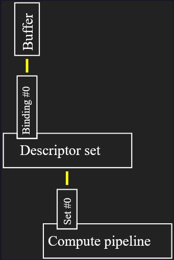
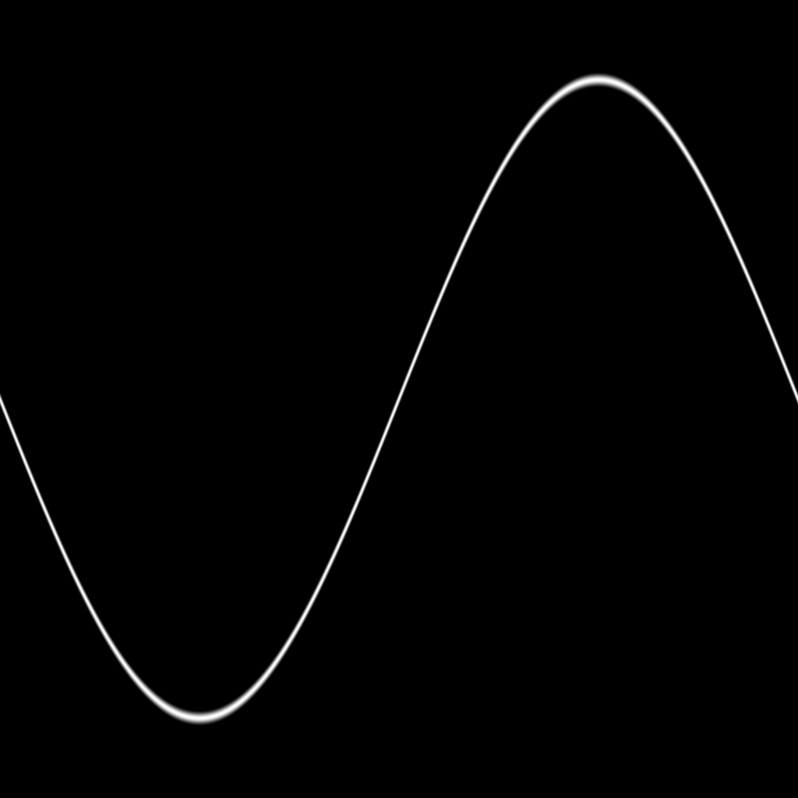

# Project Start

## Hello World!

Vulkan is a modern graphics API that I want to use to learn about low level programming and what
goes into putting something on my screen. To start I need to initialise a Rust wrapper for Vulkan
called Vulkano which allows for Rust idiomatic programming an envirionment that tends to be very
unsafe. `UNUMERATE_PORTABILITY` will allow for support in devices that do not fully conform to the
Vulkan specification. Creating an instance returns a `Result`. In the case of an error, the program
terminates and a message is printed to the console. In a production ready build, the error would be
handled a little more eloquently in the form of perhaps a dialogue box.

Next, we must chose a device on which to perform operations on. SLI is a thing of the past and the
best option to pick a device to use is to enumerate over them and pick one. There is again some
error handling but it is unlikely to fail in the average case. In some rare cases Vulkan may not be
supported on any installed physical device in which case no device can be selected.

To then communicate with this **physical** device we must perform device creation - an object
being the open channel of communication with said physical device. To do this we must also tell the
Vulkan implementation which type of queues we want to use. Queues are grouped into their queue
families which describe their capabilities.

---

### What are queues?

Just like how multithreading allows for multiple tasks to run in parrallel on a CPU, multiple
operations can also be run on your GPU. The Vulkan version of parallel processing is a **queue**.
Whenever we want the device to do something, we submit an operation to a queue. Some queues
specialise in graphics and other may be compute operations.

---

So once we have our valid queue family we use it to create our device interface to the physical
device. Slightly confusing names but in such a verbose graphics API like Vulkan, something are bound
to clash. It is at this stage that we can now ask (very politely) the GPU to perform some
operations.

## Memory allocation

Before creating buffers in memory (where I got to with OpenGL) I have to allocate some memory for
said memory buffers. From my experience in languages such as C and Zig, I have not found this very
fun even if Zig tried to make it as much of an intutitive experience as possible. For now, defaults
will do nicely. In the `memory_allocator`, `device.clone()` is passed as a paramater. Cloning the
Arc is not as expensive as the actual object itself. Device has been declared as an `Arc<device>`
meaning it is handled by the `Arc` smart pointer allowing for shared ownership (and still no
garbage collector in sight!).

## Buffers

Sending information to the GPU is relatively slow. To perform this task more efficiently, a memory
buffer is created to send information into less frequent, larger chunks. There are sevel **memory
types** to chose from each being suited to their own tasks just like queues. To chose memory, we
provide a **memory type filter** which informs the memory allocator which memory we prefer and which
memory we prefer to avoid. Some examples:
- `MemoryTypeFilter::PREFER_DEVICE | MemoryTypeFilter::HOST_SEQUENTIAL_WRITE`
    for continuously uploading data to the GPU
- `MemoryTypeFilter::PREFER_DEVICE`
    increased performance but more complex data access from the CPU
Either side of the `|` are some filters and in the second example, we even only have 1 filter. To
create a buffer, I will first allocate memory for it in memory accesible by the CPU. In the buffer,
notice that the first parameter is an `Arc` of that memory allocator we created earlier. We then
specify what we are using the buffer for, and then we create the information of the allocation. The
`memory_type_filter` is looking for `HOST_SEQUENTIAL_WRITE` memory which is good for sending a
steady stream of data. In future I may change this to accomodate rapidly changing matricies for
example with `HOST_RANDOM_ACCESS`. The final paramater is what we actualy want to send. In this case
we will send some of the most improtant information ever conceived:
>The Ultimate Question of Life, the Universe, and Everything - Douglas Adams
42.

---

### Plain old data (POD)

Vulkan works with raw memory. This means that it doesn't understand high level Rust structs or
enums. Information needs to be laid out in a way that Vulkan can understand. POD refers to
simplified data that Vulkan can understand with no hidden complexities such as pointers. A `struct`
containing the data I want to pass is now deriving `BufferContents` which is a more convenient way
of using `bytemuck` which in itself tell the compiler that a Rust type is safe to be interpreted as
a sequence of bytes. When working with simple types such as `i32` or `u8` I could get away with
using `bytemuch` but especially when working with more complex types, i need to make sure I'm using
one of these *marker traits* to ensure that data is laid out for Vulkan to use.

---

However, despite these giant leaps, most of the time we want to pass a series of values inside of a
buffer, not just one measly struct. Vulkano provides `from_data` to do this. The problem with this
is that if the amount of data we want to pass into the buffer needs to be known. If it isn't we must
use `from_iter` constructer which takes an iterator as a parameter instead of the data itself.

## Operation on 2 buffers

In line with the [Vulkano Book](https://vulkano.rs/03-buffer-creation/02-example-operation.html),
an easy operation for proof of concept is copying data from a source to a destination. In my case
I will use a vector of f32 values which would make a triangle. The source vector has normalised
screen coordinates and the destination vector is just a vector of the same size with a bunch of 0
values. And just like buffers, you need an allocator for command buffers. That's right, just like
the data we send to the GPU, sending commands one by one would also be relatively inefficient.
Therefore, we also need a `command_buffer`.

The Vulkano Book possibly makes a mistake in its documentation when it introduces the default
command buffer builder. The code I have adopted is below

```rs
let command_buffer_allocator = Arc::new(StandardCommandBufferAllocator::new(
    device.clone(),
    Default::default(),
));

let mut builder = AutoCommandBufferBuilder::primary(
    command_buffer_allocator.clone(),
    queue_family_index,
    CommandBufferUsage::OneTimeSubmit,
)
.unwrap();
```

The book says that `&command_buffer_allocator` should be passed as a refrence with the actual
`command_buffer_allocator` not even being created as an `Arc`. The solution I have adopted wraps
the allocator in an `Arc` to by used **polymorphicly** and we pass a clone instead of a refrence
as `AutoCommandBufferBuilder` expects `Arc<dyn CommandBufferAllocator>`. After these changes, we are
now creating a *builder* and then we... well build it. We're once again cloning an `Arc` which is
recourse efficient and the `queue_family_index` is needed to tell the command buffer which queue
family it will be performing operations on.

Finally we send the commands in the command buffer to the GPU. We sync with the GPU and wait for the
GPU to be ready to execute some instructions. We save the future to await for a signal from the GPU
that it has indeed completed its operation. From other research into what other people have done
with Vulkan, the `...fence...` keyword hidden auspiciosuly among everything is deceptively vital.
At a very oversimplified and high level, fences make sure that operations don't interupt each other.
They can do much more but they are a sort of hard stop. We then `read()` and `unwrap()` what now
lies in GPU memory and check to make sure that the data is infact identical (the result of a copy).

# Compute pipeline

## Operation on many values in one buffer

In order to perform operations at scale on a larger data set, I cannot just pass an array into the
GPU. The data must be treated as one buffer upon which one operation is going to performed on... for
all values. To do this, we create many worker groups ideally of sizes between 32 and 64. I
ecnoutered a couple of errors. First `shaderc` refused to play nice. Trying to `cargo run` resulted
in a curious error where by macro `src:` refused to even read in
```rs
    mod cs {
        vulkano_shaders::shader!{
            ty: "compute",
            src: r"
                #version 460
    
                layout(local_size_x = 64, local_size_y = 1, local_size_z = 1) in;
    
                layout(set = 0, binding = 0) buffer Data {
                    uint data[];
                } buf;
    
                void main() {
                    uint idx = gl_GlobalInvocationID.x;
                    buf.data[idx] *= 12;
                }
            ",
        }
    }
```
So I had to do perform an express installation even though Vulkan should have come with everthing
installed as required. Half an hour later, it still wouldn't work. Downtrodden I finally fell asleep
at 2 in the morning. Then at 1 the next day it magically worked! I must have been missing a system
restart. Other errors are detailed [here](./Agard.md). The first line of the `GLSL` language is the
version of GLSL (4.6) which at the time of writing this is pretty stable (just like the versions of
vulkano and vulkano-shaders I am using). The shader is inteded to be used 42,000 times. The vulkano
book uses the seemingly arbitrary example 65536. This is because is divides by 64 nicely. 42,000
however does not.

Total envocations: $42,000$

Larger local sizes (32->64) are recommended as they are more efficient than many small work groups.

$\frac{envocations}{group size} = \frac{42,000}{64} = 656.25$

You can't have a fraction of a work group so $657$ groups. $657 * 64 = 42,048$ leaving one group
mostly empty. This is of course inefficient at a far larger scale. If I wanted to take this approach
I would likely have to also add a check to the compute shader so it doesn't operate on the useless 
data.

---
`layout(local_size_x = 60, local_size_y = 1, local_size_z = 1) in;`

Instead of using a group size of 64 I will therefore just use a group size of 60 resulting 
instead in $\frac{42,000}{60} = 700$ worker groups.

```
layout(set = 0, binding = 0) buffer Data {
    uint data[];
} buf;
```

Here we create a descriptor where a buffer (`buf`) is going to be accessed later. The content of the
buffer is an array of `unit`s which is similar to `u32` in rust.

```         
void main() {
    uint i = gl_GlobalInvocationID.x;
    buf.data[i] *= 42;
}
```

Just like C *and* Rust the entry point of our GLSL code is a main function which is about to be
called 42,000 times. The content of the buffer we created earlier is accessed with and index `i`.
One of the few unsafe things that vulkano allows us to do is create a
[data race](./Concepts/Data-Race.md)!

Finally at runtime we can create a compute pipeline object. First thing's first, create a pipeline
layout. Vulkan will do this for us. These may be supoptimal but fine for personal projects.

## Descriptor sets

In GLSL, the buffer the shader will use was declared like this:
```glsl
layout(set = 0, binding = 0) buffer Data {
    uint data[];
} buf;
```
The buffers that a compute pipeline needs to access must be bound to what are called *descriptors*.
A descriptor or array of descriptors is assigned to a **binding**. Binding**s** can then be grouped
into *descriptor sets* in `layout(set = 0, binding = 0)`.



In addition to this, we of course need to create an allocator. When implementing a 
`PersistentDescriptorSet` we attatch it to a result buffer wrapped in a `WriteDescriptorSet`. This
object will describe how the buffer will be written. In order to create the descriptor set the
layout it is targetting must be known. `.layout()` is called on the "Pipeline" trait (in this case
we are acessing the `compute_pipeline`). The layout specific to the pass is then fetched
`.set_layouts().get(0)`. Once a descriptor set has been created you can use it in other pipelines. 
You just have to make sure that the bindings' type matches those the pipelines' shaders expect.

> ### NOTE:
> Vulkan requires that a pipeline is provided whenever a descriptor set is created. You cannot
> create a descriptor set independently

At this point we finally have a compute pipeline and a descriptor bound to it. Now we can perform
operations using them.

## Dispatch

Finally we can create the *command buffer* that will execute the compute pipeline. This is called
a **dispatch** operation.
```rust
command_buffer_builder
    .bind_pipeline_compute(compute_pipeline.clone())
    .unwrap()
    .bind_descriptor_sets(
        PipelineBindPoint::Compute,
        compute_pipeline.layout().clone(),
        descriptor_set_layout_index as u32,
        descriptor_set,
    )
    .unwrap()
    .dispatch(work_group_counts)
    .unwrap();
```
The pipeline and descriptor sets are bound indicating the type of set the layout and the descriptor
sets we are going to use. The number of sets could actually be many but we only have one so the
index is 0. The `dispatch()` method indicated the worker groups as declared
`let work_group_counts = [700, 1, 1];`. Then as before in the far more simple execution we submit
the command buffer:
```rust
let future = sync::now(device.clone())
    .then_execute(queue.clone(), command_buffer)
    .unwrap()
    .then_signal_fence_and_flush()
    .unwrap();

future.wait(None).unwrap();
```

# Simple images

## Image creation

First we pass the dimensions of the image and the desired format. Images also need to be created
with flags that describe how the image will be used but interestingly
[they don't need to be initialised](./Concepts/Images.md). `extent: [1024, 1024, 1],` are the
dimensions for example but notice that in the image we haven't given it any information.

## Image clearing

Unlike buffers, images cannot be directly modified by writing to their memory. To read or write to
an image, we need to access said image through the GPU. We are going to fill an image with a
specific colour. We call filling an image with colour *clearing* an image. `ClearColorValue`
indicates the colour we want to clear the image with. The image we created earlier is in
`R8G8B8A8_UNORM` format meaings that the RGB colours have a bit depth of 8 and are unsigned,
normalised numbers. (instead of 0->255 the colours are translated to 0.0->1.0). So
`ClearColorValue::Float([0.0, 0.0, 1.0, 1.0])` will turn the `1.0`s into 255. Now, we have the bits
necessary to create an, albeit boring, image. We however see nothing. We need an output.

## Exporting the result to a .png

First we need the buffer. The image dimensions are 1024x1024 and each pixel in the image contains 4
u8 bit values so $1024*1024*4$ is the size of the buffer.
```rs
let image_buffer = Buffer::from_iter(
    ..., // parameters for a new buffer
    ..., // parameters for a new memory allocator
    (0..1024 * 1024 * 4).map(|_| 0u8), // number of elements
).unwrap();
```
We also modify the builder from the previous section and add a copy operation. As this is a memory
transfer operation, the image elements are not interpreted as floating point values:
`clear_value: ClearColorValue::Float(` but rather the memory content is
directly copied to the buffer `.copy_image_to_buffer(CopyImageToBufferInfo::image_buffer(`
```rs
builder
    ...
    .copy_image_to_buffer(CopyImageToBufferInfo::image_buffer(
        image.clone(),
        image_buffer.clone()
    )).unwrap();
```
Now we need to turn this transfering memory into something - a PNG. Using the `image` crate, we
create the main image type called ImageBuffer from a slice. Then we save the image and voila
```rs
let image = ImageBuffer::<Rgba<u8>, _>::from_raw(1024, 1024, &buffer_content[..]).unwrap();
image.save("image.png").unwrap();
```
# Complex image

In the vulkano book, a Mandelbrot fractal shader is demonstrated. I don't fully undetstand GLSL yet
so instead, I decided to go for something simpler: a sine wave. 

## GLSL code:
```c
/*
Declares the compute shader workgroup size so each workgroup has 8x8=64 threads.
Image is 1024x1024 the GPU will dispatch 1024/8=128 groups for each dimension (twice)
*/
layout(local_size_x = 8, local_size_y = 8, local_size_z = 1) in;

/*
Declares the output as a write-only 2D texture with the format rgba8 -> each pixel has 4 channels
(Red, Green, Blue, Alpha) 8 bit each bound to descriptor set 0 binding 0
*/
layout(set = 0, binding = 0, rgba8) uniform writeonly image2D img;

void main() {
    /*
    Centering the pixel coordinate within a pixel and normalises the coordinates by dividing by
    imageSize so (0, 0) -> (0, 0) and (1023, 1023) -> (0.9995, 0.9995) rougly
    */
    vec2 norm_coordinates = (gl_GlobalInvocationID.xy + vec2(0.5)) / vec2(imageSize(img));
    
    /*
    Centers the normalised X coordinate into radians over (0, 2π) mapping the image width to one
    full sine cycle
    */
    float x = norm_coordinates.x * 2 * 3.141592653589793;

    /*
    Computes the sine wave's Y coordinate at the current X. The base line is 0.5 (centers the image
    vertically) and the amplitude is 0.4 (how high and low the peaks and troughs are). sin(x * 1.0)
    means that there is only 1 full cycle across the whole image but can increase how many at will.
    */
    float y = 0.5 + 0.4 * sin(x * 1.0);

    /*
    Computes the vertical distance between the current Y coordinate and the sine wave's Y position
    */
    float d = abs(norm_coordinates.y - y);

    /*
    The intensity value as drawn from d. smoothstep(edge0, edge1, X) smoothly interpolates between
    0.01 and 0.0. If d = 0 (exactly on the curve) then the intensity i will be 1.0 (white) but if
    d >= 0.01 (further from the curve) then i = 0.0 (black). 
    */
    float i = smoothstep(0.01, 0.0, d);

    /*
    Packs the grayscale i into RGB with alpha always 1
    */
    vec4 to_write = vec4(vec3(i), 1.0);

    imageStore(img, ivec2(gl_GlobalInvocationID.xy), to_write);
}
```
## Executing the GLSL code
The shader code now needs to be called. First we create an image:
```rs
let image = Image::new(
    ...
        usage: ImageUsage::TRANSFER_SRC
        | ImageUsage::STORAGE,  // storage attribute is important
        ..Default::default()
    },
    ...
).unwrap();
```
To pass an image to a GPU shader, we need to create an `ImageView` which describes where and how the
GPU should access or use an image. Here we want to view the entire image which is pretty basic:
`let view = ImageView::new_default(image.clone()).unwrap();`. The descriptor set then takes the
image view.
```rs
let set = PersistentDescriptorSet::new(
    ...,
    [WriteDescriptorSet::image_view(0, view.clone())],
    [],
)
```
Then we create a buffer storing the image output. The command buffer contains a dispatch command
and then we save the image. This all results in:



The sine wave results in some slightly thicker parts at the peaks and troughs. I am not really sure
why this is but this section is only really meant for demonstation purposes so I am not that fussed
about it. These... *fragments?* are more a maths/GLSL problem than a vulkan problem so for now I
will ignore.

# Windows

Every good graphics engine needs a window. To start this project I will be using
[winit]("https://crates.io/crates/winit"), the crate for **cross-platform window creation**. First
thing's first, create the `EventLoop` which acts as a 'context'. It initialises everything needed to
start creating windows such as opening a connection to say a Wayland server. These functionalities
are accessed through `create_window`. This window, once created can generate various events. The
`Window` object can for example generate a window event when a key is pressed while the window is in
focus. Events are then accessed through `EventLoop::run_app()` which will run until `exit()` is
called. After setting some window attributes for for our... well window, we can check for several
different `window_event`s such as `CloseRequested` and `RedrawRequested`. The event loop itself
is set to `ControlFlow::Poll` which continuously runs the event loop even if the OS hasn't
dispatched any events which is ideal for games and similar applications. `WindowId` is also a
member of `WindowEvent` but this is only relevant for multi-window applications which is not
something I will be persuing.
